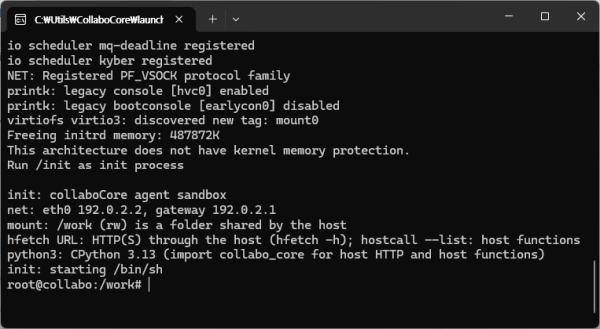

<p align="center">
  

<br>

<sub>
    Meet our mascot: a cute little friend from one of my games.
    <br>
    (Human-made! / untouched ANIMAL BOX)
  </sub>
</p>

<h1 align="center">collaboCore</h1>

<p align="center"><a href="readme.md">English</a> | <b>한국어</b></p>

관리자도 편안하고 / 에이전트도 편안한 - 올인원 샌드박스 머신 

📦 **다운로드:** [CollaboIDE Releases](https://github.com/jkhda456/CollaboIDE/releases)


## ⚡ 간편한 사용

바로 Launcher 를 실행하고 끝!

<p align="center">
  

<br>

## 🌀 편안함

 * WASM 기반의 리눅스 커널([tombl/linux](https://github.com/tombl/linux), 7.1)이 네이티브 프로세스로 구동됩니다.
 * 네트워크 / 로깅 / 내 파일 공유를 한번에
 * 에이전트에게 루트쉘을 줘도 안전합니다.


## 🚀 launcher.conf 만 바꾸세요

런타임 폴더의 `launcher.conf`에 원하는 것만 적으면 됩니다. 예를 들어 내 프로젝트를 Claude Code 에이전트에게
맡기되, 나갈 수 있는 곳은 정해두고 싶다면:

```ini
# 내 프로젝트를 /work 로, 참고 자료는 읽기 전용으로
mount = ~/projects/my-app:/work
mount = ~/datasets:/data:ro

# 에이전트가 나갈 수 있는 곳만 허용 (그 외는 전부 차단)
allow = api.anthropic.com
allow = github.com
allow = pypi.org
allow = files.pythonhosted.org

# 모든 요청을 시간과 함께 기록
log-file = logs/network.log

# 게스트 안에서 Claude Code — 키는 호스트에만 있고 게스트는 보지 못함
addon = claude-code
addon-config = claude-code:apiKey=${ANTHROPIC_API_KEY}
```

`./launcher --dry-run`은 실제로 실행될 명령줄을 보여주고(키는 가려집니다), 쓸 수 있는 키 전체는
`./launcher --help`와 함께 들어 있는 `launcher.conf`의 주석에 있습니다.


## 📐 Collabo IDE 예시

```
 Flutter 앱 ── package:collabo_core ──stdio JSON──▶ collabo-core 엔진 (Rust + wasmtime, 11 MB)
                                                    │ WebAssembly 리눅스 커널 (CPU당 스레드 1개)
                                                    │  ├ virtio-console : root 셸
                                                    │  ├ virtio-fs      : 로컬 폴더 마운트
                                                    │  ├ virtio-net     : 소켓 (정책 적용)
                                                    │  └ virtio-vsock   : 1024 에이전트 exec
                                                    │                     1080 HTTP 요청 API
                                                    │                     1081 호스트 기능 프록시
                                                    │                     1082 호스트 ssh-agent
                                                    └ 게스트: busybox, CPython 3.13 + pip, curl, ssh, git, screen,
                                                             hfetch, hostcall
```

같은 커널과 게스트 이미지는 브라우저(`dist/web`)에서도 돌아가며, 이때 워크스페이스는 IndexedDB에 저장된
zip입니다.

* **샌드박스** — 게스트는 마운트한 폴더와 허용한 호스트만 볼 수 있습니다.
* **로컬 디스크** — 호스트의 어떤 폴더든 읽기·쓰기 또는 읽기 전용으로 마운트하고, zip으로 내보낼 수 있습니다.
* **관리되는 네트워크** — 두 경로 모두에 하나의 정책: 허용/차단 목록, 호스트 자신의 localhost는 기본 차단,
**API 키는 호스트가 주입**(게스트는 키를 보지 못함), 모든 접속 시도는 이벤트로 보고됩니다.
* **Python** — python.org 배포판 그대로의 표준 라이브러리를 갖춘 CPython 3.13(290개 모듈 중 269개.
나머지는 Windows/macOS 전용이거나 fork, ctypes, 디스플레이가 필요한 것): OpenSSL 기반 ssl과 hashlib,
sqlite3, bz2/lzma, readline(BSD libedit 기반)/curses, venv, 그리고 복사 방식으로 구현한 `mmap`.
**pip**과 **openai** SDK(pydantic v2, jiter 포함)가 미리 설치되어 있으며, 이들의 Rust 확장은 게스트용으로
컴파일되어 인터프리터에 내장되어 있습니다.
`collabo_core.openai_client()`는 SDK의 요청을 호스트를 거쳐 보내고, 키는 호스트가 붙입니다.
* **네트워크 도구** — 선택형 오버레이로 curl, ssh(dropbear), git을 제공하고, busybox의 wget, nc, telnet도
있습니다. 모두 같은 정책과 이벤트를 거칩니다. `network.ask`를 쓰면 목록에 없는 호스트는 앱이 결정하고,
`sshAgent`는 호스트의 ssh-agent를 빌려주며(개인 키는 밖에 남음), `secrets`는 그 호스트로 가는 curl, git,
Python 자체의 HTTPS에도 적용됩니다(엔진이 게스트가 신뢰하는 세션별 CA로 그 TLS를 종단합니다). 같은
오버레이에 **GNU screen** 5.0(세션, 창, 분리와 재접속)도 들어 있으며, `fork()`가 없는 게스트에 맞게
이식했습니다.
* **호스트 접근** — 앱이 이름 붙인 함수를 노출합니다. 호스트 프로그램 실행은 `deny` / `ask` / `allow`이며,
`ask`이면 요청마다 앱에 묻습니다.
* **배포는 폴더 하나** — 94 MB 런타임 폴더: 엔진(11 MB), 커널, 게스트 이미지(pip과 패키지를 포함한
Python이 62 MB, 네트워크 도구가 14 MB). Node.js도, 컨테이너도, VM도 필요 없습니다.

## 구성 요소

|경로|내용|
|-|-|
|`engine/`|배포되는 런타임: Rust + wasmtime. 커널을 부팅하고 virtio console/fs/net/vsock, HTTP 요청 API, 호스트 기능, stdio 제어 프로토콜을 제공|
|`kernel/`|WebAssembly 커널 빌드 (커널 소스 트리는 clone해서 받음)|
|`userspace/`|musl, compiler-rt, busybox, `/init`, 게스트 도구(`hfetch`, `hostcall`, `collabo-agentd`) → `initramfs.cpio`. `patches/`에는 busybox 패치(vi에서 한국어 등 UTF-8 텍스트 편집)|
|`python/`|게스트용으로 크로스 빌드한 CPython 3.13, C 라이브러리, 게스트용 Rust(pydantic-core, jiter), pip, openai SDK → `python.cpio`. `lib/`에는 `collabo_core`와 `mmap`|
|`nettools/`|게스트용 curl, dropbear(ssh), git, GNU screen과 배포판 패치(screen 패치는 자체 작성) → `tools.cpio`|
|`dart/collabo_core/`|앱이 쓰는 Dart 패키지. `SandboxTools`는 샌드박스를 LLM 도구로 노출|
|`flutter/collabo_core_demo/`|데스크톱 데모 앱. 세 플랫폼에서 런타임을 번들하는 방법 포함|
|`addons/`|앱이 부팅할 때 붙일 수 있는 선택형 오버레이(`addons/README.md`). `claude-code`: 게스트용 Claude Code, Anthropic 또는 OpenAI 호환(로컬) 모델 사용|
|`web/`, `host/`|브라우저 빌드와, 그것과 공유하는 호스트 모듈|
|`runtime/src/`|이전의 Node 구현. 엔진 포팅의 원본으로 남겨둠 (배포물에는 포함되지 않음)|
|`tests/`, `docs/note.md`|검사들, 그리고 결정 사항과 함정을 적는 작업 기록|

## 빌드

Ubuntu x64. 시스템 패키지를 한 번 설치한 뒤 빌드합니다:

```sh
sudo apt-get install -y make flex bison bc pkg-config libncurses-dev device-tree-compiler \
     wabt clang-19 lld-19 llvm-19 rsync python3 openssl git curl xz-utils patch

./build.sh                  # 전체: 처음엔 ~25분 (대부분 커널과 CPython)
./build.sh --help           # 아래 단계와 명령들
```

그 밖의 것 — Node, CMake, Ninja, Binaryen, Rust 툴체인, 두 업스트림 clone(`kernel/linux`,
`third_party/distro`), Rust nightly, 게스트 Python을 빌드하는 모든 소스와 wheel(`python/sources.lock`,
`python/packages.lock`에 체크섬 고정) — 은 빌드가 root 권한 없이 직접 받아옵니다.

```sh
./build.sh engine web runtime         # 이 단계들만
./build.sh test --all                 # 단위, 게스트 부팅, end-to-end, Dart, Flutter 검사
./build.sh release                    # dist/release: 아카이브, SHA256SUMS, VERSION
./build.sh clean [dist|build|all]     # 빌드 산출물 삭제 (DRY=1이면 지울 대상만 표시)
./build.sh export DIR                 # 소스만 복사, 바로 커밋할 수 있는 상태로
```

`./build.sh`만 실행하면 tools, kernel, userspace, python, engine, web, runtime을 빌드합니다. 게스트의
네트워크 도구(curl, ssh, git, screen)와 add-on은 별도 단계입니다. `python` 뒤, `engine` 앞에 실행해야
하며, 그렇지 않으면 런타임에 포함되지 않습니다:

```sh
./nettools/build.sh                   # -> nettools/out/tools.cpio
./addons/build.sh                     # -> addons/*/out/*.cpio
./build.sh engine runtime             # 위 결과물을 포함 (번들되는 add-on만: addons/README.md)
```

스크립트들은 서로를 직접 호출하므로 실행 권한이 있어야 합니다. 실행 권한이 사라진 checkout(Windows에서 한
커밋, 공유 폴더를 통한 복사)은 먼저 스크립트에 `chmod +x`가 필요합니다. `.gitattributes`는 스크립트, 패치,
게스트의 `/etc`를 모든 플랫폼에서 LF로 유지합니다.

커널과 게스트 이미지는 어디서나 같으므로 여기서 한 번만 빌드합니다. 엔진은 네이티브 코드이므로 **플랫폼마다
각자 빌드**합니다: `./build.sh runtime`(= `scripts/package-runtime.sh`, Windows에서는 bash가 필요 없는
`scripts/package-runtime-windows.ps1`). CI 워크플로가 여섯 플랫폼에서 이를 수행하고 테스트를 돌립니다.

앱 없이 실행해 보기:

```sh
cd dist/runtime/collabo-core-linux-x64        # 아래 경로는 여기 기준
bin/collabo-core-engine --kernel app/images/vmlinux.wasm \
  --initramfs app/images/initramfs.cpio --initramfs app/images/python.cpio \
  --mount "$OLDPWD:/work"                     # 이 터미널에 root 셸; Ctrl-] 후 q로 종료
```

또는 인자 없이 런타임 폴더의 `./launcher`(`launcher.exe`)를 실행합니다. manifest의 이미지와 옆에 있는
`launcher.conf`의 옵션으로 엔진을 시작하며, 기본값은 `bin/` 옆의 빈 `work/` 폴더를 `/work`로 공유하는
것입니다. `./launcher --dry-run`은 실행할 명령줄을 보여줍니다. add-on은 manifest나 `launcher.conf`가 다른
`addon-dir`를 지정하지 않는 한 `app/images/addons`에서 찾으므로, `./launcher --addon NAME`은 그대로
동작합니다.

`bin/collabo-core-engine --help`는 모든 옵션(한 명령 실행용 `exec`, 네트워크 정책, add-on, 터미널)을
보여줍니다.

## 더 보기

[readme.detail.md](readme.detail.md) — 구현·검증 현황, Flutter 통합과 번들링, 전체 설정, 게스트 도구,
보안 모델, 제어 프로토콜.
[docs/note.md](docs/note.md) — 작업 기록.

